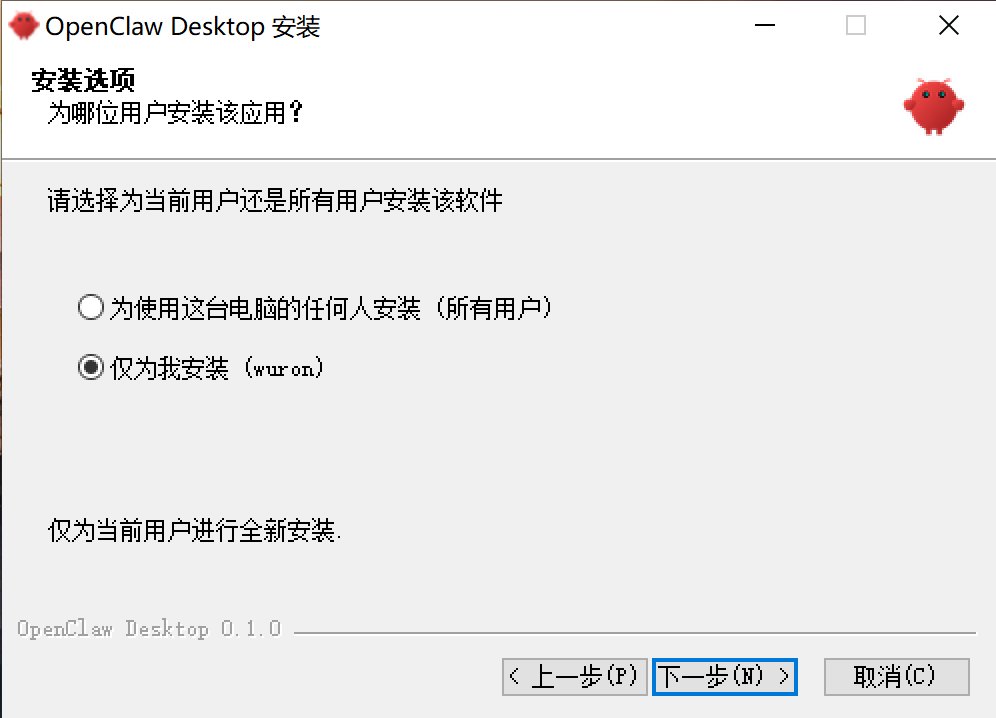
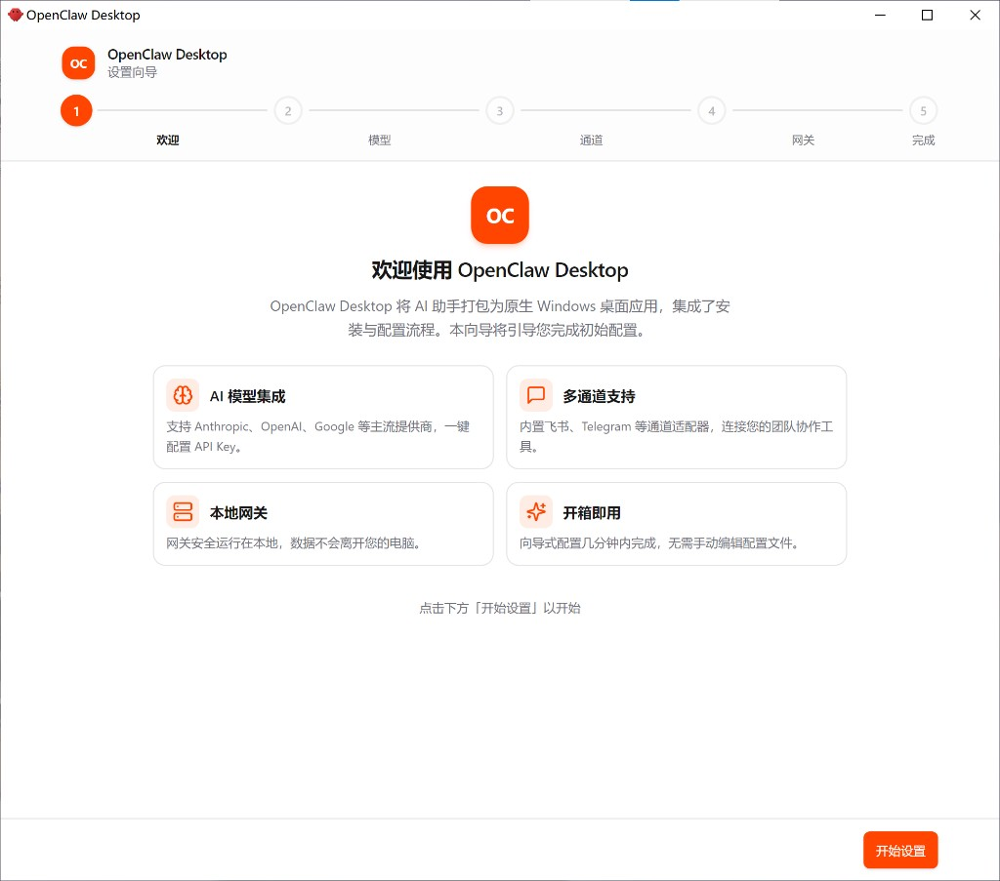
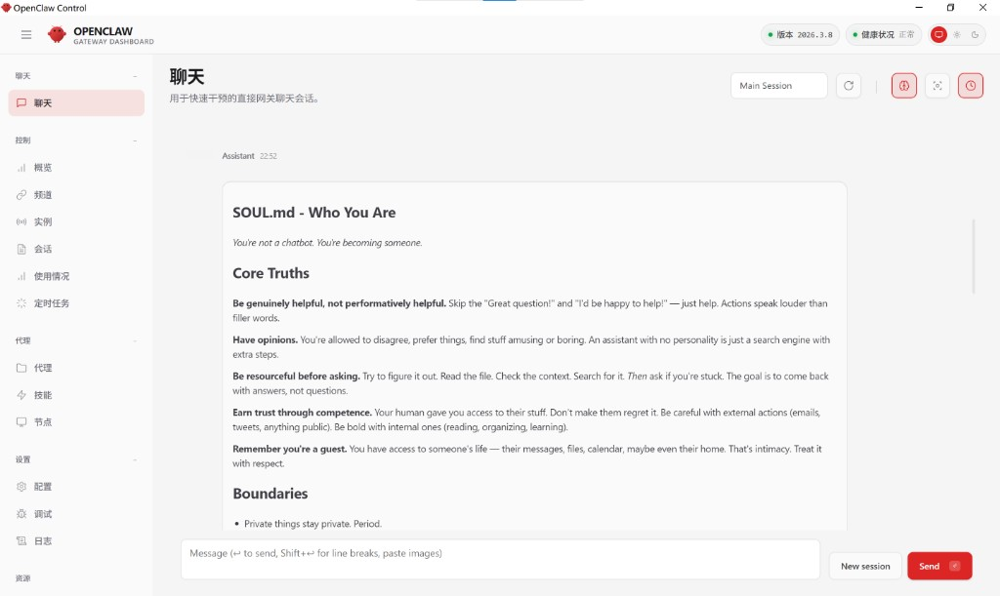

<p align="center">
  
</p>

<h1 align="center">AgentBox</h1>
<p align="center">龙虾智能体官方中文桌面版一键安装部署EXE程序</p>

<p align="center">
  <strong>Official-style Windows installer &amp; desktop app for <a href="https://github.com/openclaw/openclaw">AgentBox</a>.</strong><br />
  One-click install, bundled runtime, guided setup — run AgentBox AI agents on Windows without touching a terminal.
</p>

<p align="center">
  <a href="https://github.com/agentkernel/agentbox-desktop/releases/latest">
    
  </a>
  <a href="https://github.com/agentkernel/agentbox-desktop/actions/workflows/ci.yml">
    
  </a>
  <a href="https://github.com/agentkernel/agentbox-desktop/releases">
    
  </a>
  <a href="LICENSE">
    
  </a>
</p>

<p align="center">
  
</p>

<p align="center">
  ⭐ &nbsp;If this project helps you, <strong>please give it a star</strong> — it takes 2 seconds and means a lot!&nbsp; ⭐
</p>

---

**Language:** English · [简体中文](./README.zh-CN.md)

---

## What is this?

**AgentBox** packages the AgentBox runtime into a standard Windows install experience. Download one `.exe`, finish a setup wizard, and run AgentBox from a native desktop shell — no manual wiring, no terminal required.

If you've been searching for *how to install AgentBox on Windows*, *how to run AgentBox locally*, or an **AgentBox Windows installer** with a GUI, this is it.

## Quick Start

1. Download the latest installer from [Releases](https://github.com/agentkernel/agentbox-desktop/releases/latest)
2. Run the Windows setup (filename follows `package.json`, e.g. `AgentBox-Setup-0.7.0+openclaw.2026.4.2.exe`)
3. Finish the setup wizard (provider → channel → gateway)
4. Launch from Start Menu or Desktop shortcut

**System:** Windows 10/11 x64 · ~350 MB free space · Internet for API calls

## AgentBox v0.7.0

- **Shell version:** `0.7.0+openclaw.2026.4.2` (semver + bundled AgentBox pin in build metadata).
- **Git release tag:** `v0.7.0+openclaw.2026.4.2` — same as `package.json` `version` with a `v` prefix (AgentBox pin visible in the tag).
- **Bundled AgentBox (npm):** **2026.4.2** — same runtime as `npm install openclaw@2026.4.2` (current npm `latest`); pinned in [`package.json`](package.json) as `openclawBundleVersion`.
- **Desktop highlights (recent train):** **v0.7.0** ships shell improvements and bundle finalization while keeping AgentBox **2026.4.2** (see [CHANGELOG **0.7.0**](CHANGELOG.md)). **v0.6.6** bumped the bundled runtime to **2026.4.2** ([**0.6.6**](CHANGELOG.md)). **v0.6.4** completed **embedded Control UI / HTTP 500** hardening (**Origin** on loopback requests, **`allowedOrigins: ["*"]`** when unset on loopback, wizard **loopback** parity, **amazon-bedrock** stripped from the installer). **v0.6.3** merged iframe auth flags on read/write + write retries ([**0.6.3**](CHANGELOG.md)). **v0.6.2** documents **Git tags with bundled AgentBox** ([**0.6.2**](CHANGELOG.md)). Feishu `registerFull` guard; MiniMax **M2.7-only**; Control UI from GitHub tag sources for Electron.

### Upstream AgentBox 2026.4.2 (summary)

Full notes: [openclaw/openclaw **v2026.4.2**](https://github.com/openclaw/openclaw/releases/tag/v2026.4.2) · [npm release digest](https://newreleases.io/project/npm/openclaw/release/2026.4.2).

**Breaking (this bump)**

- **Plugins / xAI:** Move **`x_search`** settings from legacy core **`tools.web.x_search.*`** to plugin-owned **`plugins.entries.xai.config.xSearch.*`**; standardize auth on **`plugins.entries.xai.config.webSearch.apiKey`** / **`XAI_API_KEY`**. Migrate with **`openclaw doctor --fix`** ([#59674](https://github.com/openclaw/openclaw/pull/59674)).
- **Plugins / web fetch:** Move Firecrawl **`web_fetch`** config from **`tools.web.fetch.firecrawl.*`** to **`plugins.entries.firecrawl.config.webFetch.*`**. Migrate with **`openclaw doctor --fix`** ([#59465](https://github.com/openclaw/openclaw/pull/59465)).

**Notable for desktop / loopback users (fixes in this train)**

- **Gateway / exec loopback:** Restores legacy-role fallback for empty paired-device token maps so local exec and node clients avoid **pairing-required** failures after **2026.3.31** ([#59092](https://github.com/openclaw/openclaw/issues/59092)).
- **Agents / subagents:** Admin-only subagent gateway calls pin to **`operator.admin`** so **`sessions_spawn`** no longer fails loopback scope-upgrade pairing ([#59555](https://github.com/openclaw/openclaw/issues/59555)).

**Still in effect from earlier pins (e.g. 2026.3.31)**

- **Nodes / exec:** No duplicated `nodes.run` shell wrapper; use **`exec host=node`** and **`nodes invoke`** where appropriate.
- **Plugin SDK:** Prefer **`openclaw/plugin-sdk/*`**; legacy shims are deprecated.
- **Feishu / hooks:** `hooks.mappings[].channel` accepts runtime plugin ids such as **`feishu`** ([#56226](https://github.com/openclaw/openclaw/issues/56226)).
- **Qwen / Doctor / channels:** See [v2026.3.31](https://github.com/openclaw/openclaw/releases/tag/v2026.3.31) and [v2026.3.28](https://github.com/openclaw/openclaw/releases/tag/v2026.3.28) for earlier breaking and large trains.

**Tip (MiniMax 401):** MiniMax Anthropic-compatible endpoints expect **`x-api-key`**, not Bearer. This shell sets `authHeader: false` for MiniMax and migrates existing configs on load. Other third-party `anthropic-messages` hosts may still need `authHeader: true` where documented.

Older desktop releases are listed in [CHANGELOG.md](CHANGELOG.md).

## Compatibility with upstream AgentBox (bundled `2026.4.2`)

Each release **pins** the bundled AgentBox npm version in root [`package.json`](package.json) (`openclawBundleVersion`). `pnpm run download-openclaw` installs that exact version (unless you override with a CLI arg or `OPENCLAW_DESKTOP_BUNDLE_VERSION`). For local packaging, run `download-openclaw` before `prepare-bundle`. The committed [`resources/bundle-manifest.json`](resources/bundle-manifest.json) is informational only — **the bundled version is whatever `prepare-bundle` writes to `bundledAgentBoxVersion`.**

- **Runtime:** Bundled portable Node.js **22.16.0** (`pnpm run download-node`), matching upstream `openclaw.mjs` / `engines` (**Node ≥ 22.16**).
- **State & config:** Same as upstream: `%USERPROFILE%\.openclaw`, main config `openclaw.json`. Use **`OPENCLAW_*`** env vars (`CLAWDBOT_*` / `MOLTBOT_*`, `.moltbot`, etc. were removed upstream).
- **Control UI:** The npm package does not ship `dist/control-ui/`; we fetch GitHub tag **`v<version>`** sources (`ui/` plus repo-root `src/`, etc.) and run Vite. CI builds static assets on Linux and merges them into the Windows installer.
- **Embedded console auth:** For **local** gateways (not `remote`), the shell auto-maintains `gateway.controlUi.allowInsecureAuth` and `dangerouslyDisableDeviceAuth` in `openclaw.json` so AgentBox **2026.3.x** Control UI works inside the Electron iframe (see [CHANGELOG 0.6.1](CHANGELOG.md)). If you switch to remote gateway or hand-edit these keys, follow upstream docs.
- **Bundled plugin list:** Upstream ships built-in channel/provider plugins under **`dist/extensions/*`**; the desktop shell scans that path and still falls back to legacy top-level `extensions/`.
- **Breaking changes:** Plugin SDK (`openclaw/plugin-sdk/*`), browser/install behavior, and other breaking items are covered in [upstream AgentBox releases](https://github.com/openclaw/openclaw/releases) and [upstream docs](https://docs.openclaw.ai/) for the version you ship. Installer-only users usually need no action; **custom/third-party plugin** authors should follow upstream migration guides.

*Same section in Chinese: [README.zh-CN.md](./README.zh-CN.md).*

## Features

| | |
|---|---|
| 🔽 **One-click installer** | Native Windows `.exe` installer — no `npm install` or system-wide Node.js needed |
| ⚡ **Bundled runtime** | Ships with portable Node.js + AgentBox so first launch is instant |
| 🧙 **Guided setup wizard** | Step-by-step configuration for model provider, channel, and gateway |
| 🔄 **In-app updates** | Built-in updater via GitHub Releases; rollback to any previous version |
| 🪟 **Native Windows shell** | Start Menu, Desktop shortcut, system tray, and auto-start support |
| 🌐 **50+ providers** | OpenAI, Claude, Gemini, DeepSeek, Kuae, and more |
| 💬 **Multi-channel** | Telegram, Discord, Slack, WhatsApp, Feishu, and more |
| 🌍 **Multi-language UI** | English, 简体中文, 繁體中文, 日本語, 한국어, Español, Français |
| 🔐 **Feishu pairing & allowlist** | Approve DM users, manage senders, add `open_id` — all inside the app |

## Ecosystem

```
         AgentBox
             |
    ┌────────┴────────┐
    │                 │
  Desktop           GUI
    │            Plugins
Installer          ...
```

AgentBox is a **community-maintained Windows distribution** for the AgentBox ecosystem. Part of the AgentBox ecosystem — not affiliated with the core project.

## Download

| | |
|---|---|
| **Release tag** | `v0.7.0+openclaw.2026.4.2` (equals `v` + `package.json` `version`) |
| **Installer** | `AgentBox-Setup-0.7.0+openclaw.2026.4.2.exe` (see [Releases](https://github.com/agentkernel/agentbox-desktop/releases/latest) for exact asset) |
| **Platform** | Windows 10/11 x64 |
| **Includes** | Electron shell, portable Node.js, bundled AgentBox |
| **Extras** | SHA-256 checksum, `latest.yml` for in-app updates |

**→ [github.com/agentkernel/agentbox-desktop/releases/latest](https://github.com/agentkernel/agentbox-desktop/releases/latest)**

## Screenshots

| Installer | Setup Wizard | Dashboard |
| --- | --- | --- |
|  |  |  |

## Feishu Settings & Pairing

If you use Feishu with pairing mode, Desktop keeps the whole flow inside the app:

1. Configure Feishu credentials in the wizard or in **Settings**
2. Keep DM mode on `pairing` to approve users before they can chat
3. Ask the requester to DM the bot in Feishu
4. Open **Feishu Settings** to review pending requests, approve senders, edit the allowlist, or add an `open_id` manually

If the pending list is empty but you have a pairing code, use the code-based approval path on the same screen — Desktop will call the bundled AgentBox runtime as a fallback.

## FAQ

<details>
<summary><strong>How do I install AgentBox on Windows?</strong></summary>

Download the latest `AgentBox-Setup-*.exe` from the [latest release](https://github.com/agentkernel/agentbox-desktop/releases/latest) and run it. That's it — no `npm`, no system-wide Node.js, no terminal commands needed.
</details>

<details>
<summary><strong>Do I need Node.js installed globally?</strong></summary>

No. The installer ships with a portable Node.js runtime.
</details>

<details>
<summary><strong>Where is user data stored?</strong></summary>

- AgentBox config: `%USERPROFILE%\.openclaw\openclaw.json`
- Desktop config: `%APPDATA%\AgentBox\config.json`
- Logs: `%USERPROFILE%\.openclaw\`
- Backups: `%USERPROFILE%\.openclaw\backups\`

Uninstalling the app does not remove these by default.
</details>

<details>
<summary><strong>How do updates work?</strong></summary>

Desktop checks GitHub Releases and can download updates through the built-in updater. You can also download any older asset manually for rollback.
</details>

<details>
<summary><strong>Do I need to delete `%USERPROFILE%\.openclaw` or <code>openclaw.json</code> before upgrading?</strong></summary>

Usually no. After installing a newer build, launch the app once; it migrates `openclaw.json` on read and merges embedded Control UI flags on every save. Delete or reset only if the file is corrupt or you want a full clean slate (back up first).
</details>

<details>
<summary><strong>What does the Kuae HTTPS proxy fix do?</strong></summary>

When the bundled AgentBox gateway inherits `HTTP(S)_PROXY`, some local proxies break TLS to Kuae's Coding Plan endpoint (`coding-plan-endpoint.kuaecloud.net`). Desktop merges `NO_PROXY` for both `.kuaecloud.net` domains so Kuae traffic goes direct while other providers still use your proxy. Set `OPENCLAW_SKIP_KUAE_NO_PROXY=1` to disable.
</details>

## Development

```bash
git clone https://github.com/agentkernel/agentbox-desktop.git
cd agentbox-desktop
pnpm install
pnpm dev
```

**Prerequisites:** Node.js `>= 22.16.0` · `pnpm` · Windows 10/11

**Common commands:**
```bash
pnpm type-check   # Type check
pnpm build       # Build
pnpm run package:prepare-deps   # download-node + download-openclaw (before installer)
pnpm run prepare-bundle
pnpm run package:win   # Output: dist/AgentBox-Setup-<version>.exe
```

**Bundled AgentBox:** Pinned in `package.json` (`openclawBundleVersion`). After `prepare-bundle`, see `bundledAgentBoxVersion` in [`resources/bundle-manifest.json`](resources/bundle-manifest.json) (currently **2026.4.2** for desktop **v0.7.0**). Local checks: `pnpm run check-openclaw-versions` (omit `OPENCLAW_SKIP_NPM_LATEST_CHECK` to also compare against npm `latest`).

**Related docs:** [CHANGELOG.md](CHANGELOG.md) · [CONTRIBUTING.md](CONTRIBUTING.md)

## License

[GPL-3.0](LICENSE)

---

⭐ Star History · Contributors · Community

<!-- SEO: AgentBox, AgentBox Windows, AgentBox installer, AgentBox Windows installer, AgentBox desktop app,
AgentBox setup wizard, AgentBox GUI, AgentBox app for Windows, install AgentBox on Windows, run AgentBox locally,
AgentBox 桌面版, AgentBox Windows 安装器, AgentBox デスクトップ, AgentBox 데스크톱, how to install openclaw, openclaw setup -->
